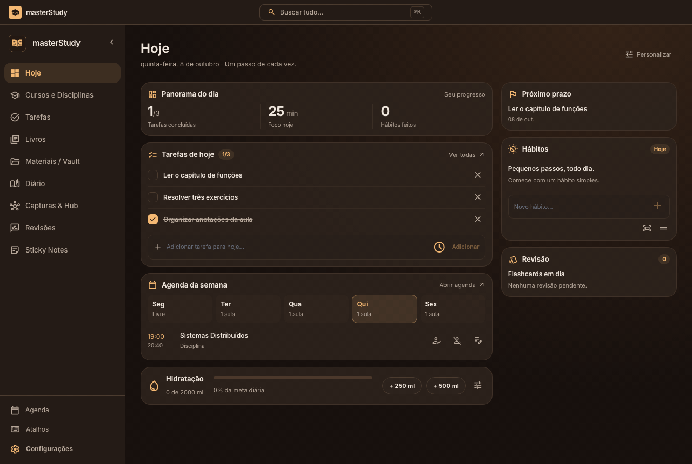
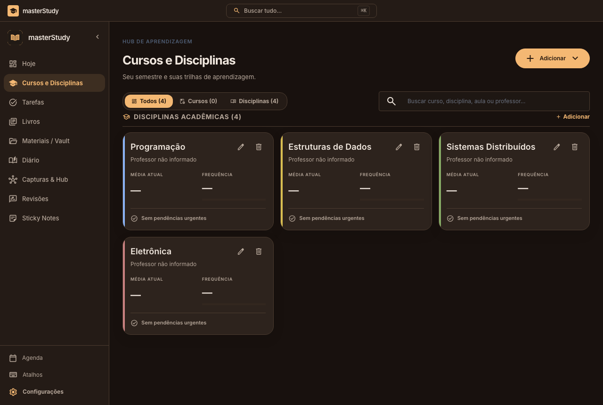
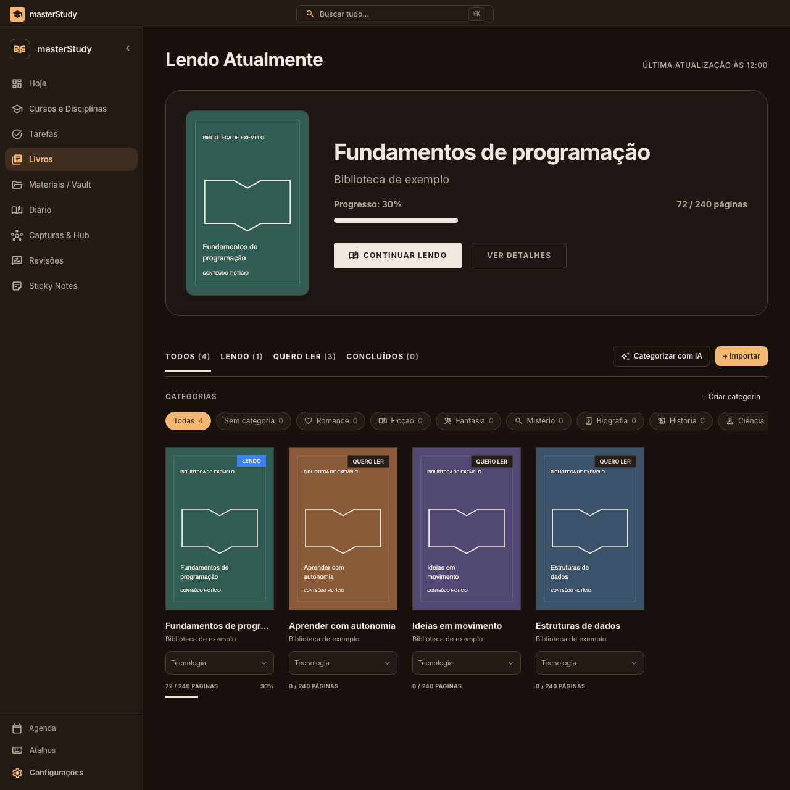
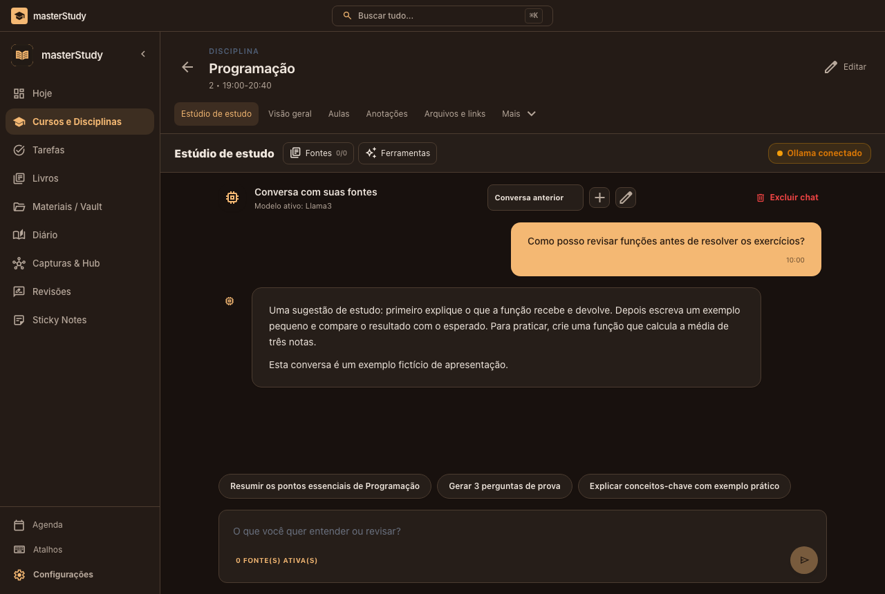
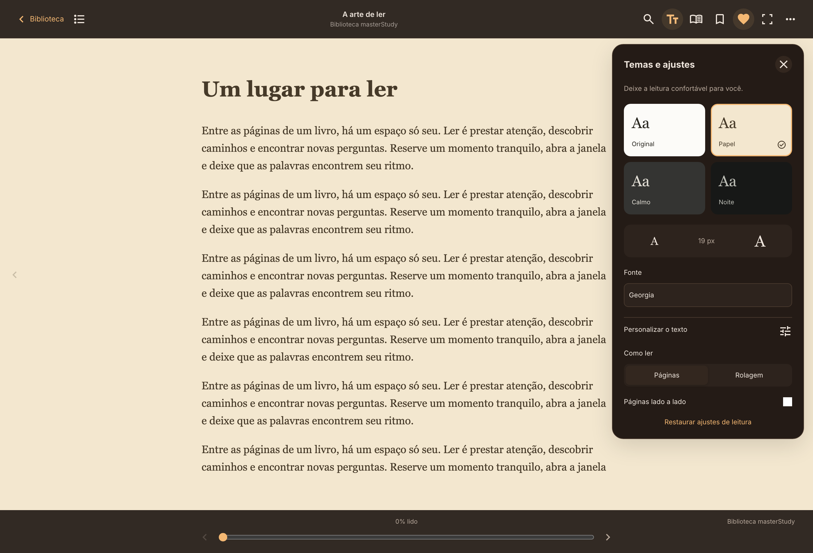

<p align="center"></p>

<h1 align="center">masterStudy</h1>

<p align="center">Organize your routine. Connect your ideas. Keep learning.</p>

<p align="center"><a href="https://master-study-three.vercel.app/">Open the app</a> · <a href="https://github.com/masterCorehub/masterStudy/releases">Releases</a> · <a href="https://github.com/masterCorehub/masterStudy/issues">Report an issue</a></p>

**masterStudy** is an academic organization and study app for web and desktop. It brings courses, tasks, books, notes, and reviews together, with **local AI study tools** and **desktop shortcuts for everyday work**.

Maintained by [Alexandre Wayss](https://github.com/alexandre-wayss), the project combines a usable learning workspace with ongoing software development and maintenance.

## Local AI for studying and writing

Connect **Ollama** to use models running on your own computer. Turn selected class materials and notes into study resources, ask questions about their content, and get help developing your writing.

| Tool | What it helps you do |
| --- | --- |
| Flashcard generation | Create question-and-answer cards from your study materials and use them for review |
| Writing assistant | Rewrite passages, adjust tone, summarize ideas, and ask for explanations while working on a note |
| Class material analysis | Ask questions about notes and supported attachments, using the selected sources as context |
| Practice questions | Generate multiple-choice questions with answers and explanations |
| Study guides | Build guides with concepts, examples, a glossary, and exam preparation tips |
| Review plans and summaries | Organize revision into sessions and exercises, or extract the essential concepts |
| Mind maps | Generate a hierarchy of concepts and their relationships from the study sources |
| Separate study chats | Keep conversations organized by topic in the Study Studio |

To get started, run Ollama with an installed model, select **Ollama local** in the app's AI settings, and choose the model to use. Results depend on the model, available hardware, and the quality of the source material. Review generated content before using it for an assignment or exam.

**Google Gemini** is also available as a cloud provider. With Ollama selected, model inference runs locally; with Gemini selected, the context sent for the request is processed by the configured online service. Screen translation is a separate feature and may use an online translation service even when the study assistant uses Ollama.

## Everyday tools, one shortcut away

The desktop app provides quick-access windows for taking notes, drawing, translating text, extracting text from the screen, and generating flashcards. Supported global shortcuts work while the desktop app is running, including when another application is in front.

**Mod** means **Command (⌘)** on macOS and **Control** on Windows/Linux. **Alt** means **Option (⌥)** on macOS.

| Action | Default shortcut | Scope |
| --- | --- | --- |
| Find or create a quick note | `Mod + Shift + Alt + 1` | Desktop global shortcut |
| Open the quick drawing board | `Mod + Shift + Alt + 2` | Desktop global shortcut |
| Open text translation | `Mod + Shift + Alt + 3` | Desktop global shortcut |
| Capture a screen area and extract text with OCR for translation | `Mod + Shift + Alt + 4` | Desktop global shortcut |
| Open AI flashcard generation | `Mod + Shift + Alt + 5` | Desktop global shortcut |
| Open Sticky Notes | `Mod + Shift + Alt + 6` | Desktop global shortcut |
| Open the command palette | `Mod + K` | In-app |
| Find a note across vaults | `Mod + O` | Note workspace |
| Create a capture | `Mod + Shift + K` | Knowledge Hub |
| Focus the Hub search | `Mod + /` | Knowledge Hub |
| Save the current note or journal entry | `Mod + S` | Supported editors |
| Close the active note tab | `Mod + W` | Note editor |
| Open settings | `Mod + ,` | In-app |

For example, select a region of a lecture slide with the OCR shortcut to extract its text for translation, or open the flashcard window while studying a document. Global shortcuts can be customized in **Settings → Shortcuts**. Availability depends on the platform, system permissions, and whether another application has reserved the same key combination.

## See the app in action


**Today** brings daily tasks, deadlines, and your schedule together so you can choose what to work on next.

### A quick walkthrough



Create and complete a task, then navigate through subjects and the book library. The demo shows the real interface with fictional sample data.

### Explore the workspace

Click an image to view it at full size.

<table>
  <tr>
    <td width="50%"><strong>Courses and subjects</strong><br>Organize classes and learning materials.<br><a href="branding/screenshots/disciplinas.png"></a></td>
    <td width="50%"><strong>Library</strong><br>Keep track of books and reading progress.<br><a href="branding/screenshots/biblioteca.png"></a></td>
  </tr>
  <tr>
    <td width="50%"><strong>Study Studio</strong><br>Keep separate chats and explore your sources.<br><a href="branding/screenshots/estudio.png"></a></td>
    <td width="50%"><strong>Reader</strong><br>Read and customize the reading experience.<br><a href="branding/screenshots/leitor.png"></a></td>
  </tr>
</table>

_The screenshots show the Portuguese interface with sample content. Visual demonstrations do not validate external account or AI services. This README is in English; the app's study-generation prompts currently request Brazilian Portuguese output._

## Features

| Area | What you can do |
| --- | --- |
| Today | View today's tasks, schedule, habits, hydration, and pinned notes |
| Courses and subjects | Organize subjects, lessons, assessments, and study materials |
| Calendar and tasks | Track appointments, deadlines, subtasks, and completed work |
| Study Studio | Maintain topic-based chats and work with selected sources and AI tools |
| Library and reader | Import PDF/EPUB books, read, highlight, annotate, and resume your progress |
| Notes and vaults | Organize notes with folders and tags, link ideas, and explore their connections |
| Reviews | Practice with flashcards and spaced repetition |
| Journal and Sticky Notes | Record reflections, quick ideas, and reminders |
| Captures & Hub | Save text and references found during research |
| Personalization | Choose themes and customize navigation and the Today layout |

Additional tools support lessons, media, language learning, programming, translation, and text recognition. Availability varies by platform and configuration.

## A typical workflow

**Plan → gather materials → study → take notes → review.**

To prepare for an exam, organize the subject and deadline, gather class materials, read a chapter, write down your explanation, and generate practice questions or flashcards. You choose the sources and confirm each action; you can use only the areas that fit your routine.

Start with **one task, one source, and one note**. The web app requires an account; this repository does not provide public demo credentials.

## Web and desktop

[Open the web app](https://master-study-three.vercel.app/) in your browser. The desktop app adds system integrations such as floating windows, global shortcuts, screen capture, and local file access.

Installers will be available under [Releases](https://github.com/masterCorehub/masterStudy/releases) when published. Packaging targets exist for macOS, Windows, and Linux, but this does not establish that releases have been validated on every platform. Local macOS packages use ad-hoc signing and are not Apple-notarized distributions.

## Run locally

Use **Node.js 24**, npm, and Git. Run commands from the application package:

```bash
git clone https://github.com/masterCorehub/masterStudy.git
cd masterStudy/studyhub-desktop
npm ci
cp .env.example .env
```

Fill in `.env` with your Supabase project URL, public client key, and public app URL as shown in the example. Never place an administrative key in a `VITE_*` variable. See [Supabase setup](studyhub-desktop/supabase/README.md) and [web deployment](studyhub-desktop/WEB.md).

```bash
npm run dev:web # Browser interface.
npm run dev     # Electron desktop app.
```

For local AI, install and run Ollama separately, download a model suitable for your computer, and configure it in the app's AI settings.

## Project structure

```text
masterStudy/
├── branding/               # Product identity and demo media
├── .github/                # CI and contribution templates
├── README.md               # Overview and quick start
├── CONTRIBUTING.md         # Contribution workflow
├── SECURITY.md             # Security guidance
└── studyhub-desktop/
    ├── src/                # UI, domain logic, services, and state
    ├── electron/           # Desktop integration
    ├── native/             # Platform bridges
    ├── public/             # Application assets
    ├── tests/              # Automated tests
    ├── scripts/            # Development and distribution
    ├── supabase/           # Accounts, permissions, and synchronization
    └── studyhub-extension/ # Browser capture extension
```

The technical name `studyhub-desktop` and legacy identifiers remain to preserve compatibility with existing data and integrations.

## Technology and quality

React, Vite, and Electron power the web and desktop interface. The project also uses Zustand, Supabase, PDF/EPUB readers, Ollama and Gemini integrations, OCR, and Playwright.

From `studyhub-desktop`:

```bash
npm test
npm run build
npm run audit:prod
npx playwright install chromium
npm run test:e2e
```

CI runs tests, a production build, and a production dependency audit on pushes and pull requests. Simulated tests do not replace validation of real services or distributed desktop packages.

## Data and current limitations

- Synchronization does not necessarily transfer every local book or attachment.
- The export available in Settings is partial; keep important original files.
- AI requires configuration and review. Cloud providers may receive the context included in a request.
- Notifications require permission and may stop when the app is closed.
- The browser extension sends captures to the running desktop app; its local bridge is not a public service.

## Contributing and support

Read [CONTRIBUTING.md](CONTRIBUTING.md). When reporting a bug, include reproduction steps, version, platform, and expected behavior. Use fictional data in screenshots and test cases. For vulnerabilities, follow [SECURITY.md](SECURITY.md).

## License

A reuse license has not yet been selected by the maintainer.
