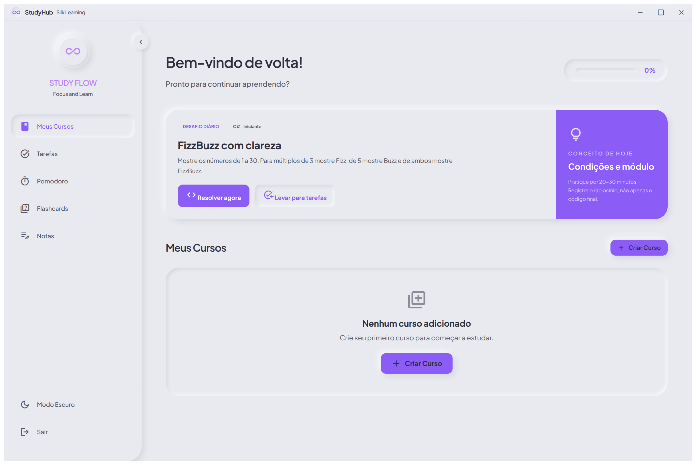
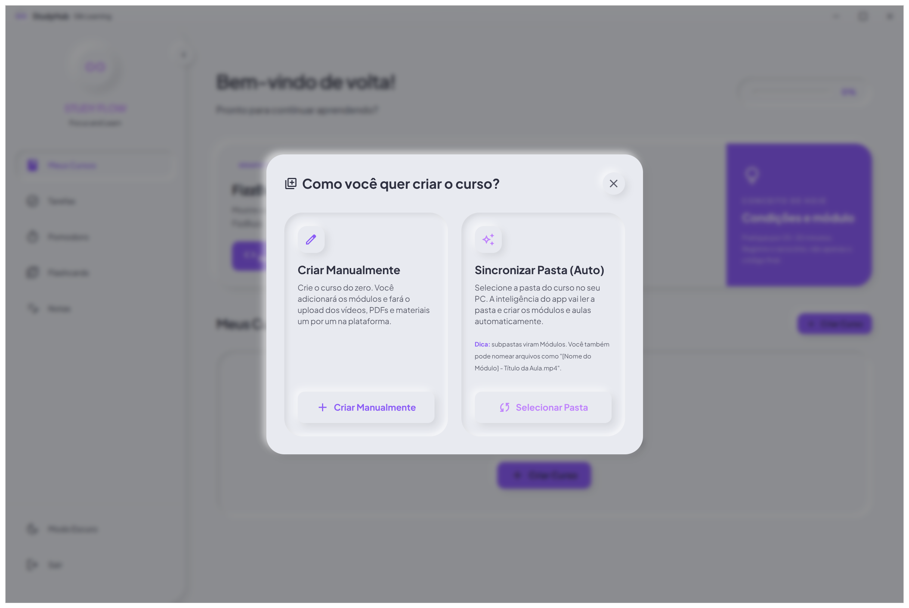
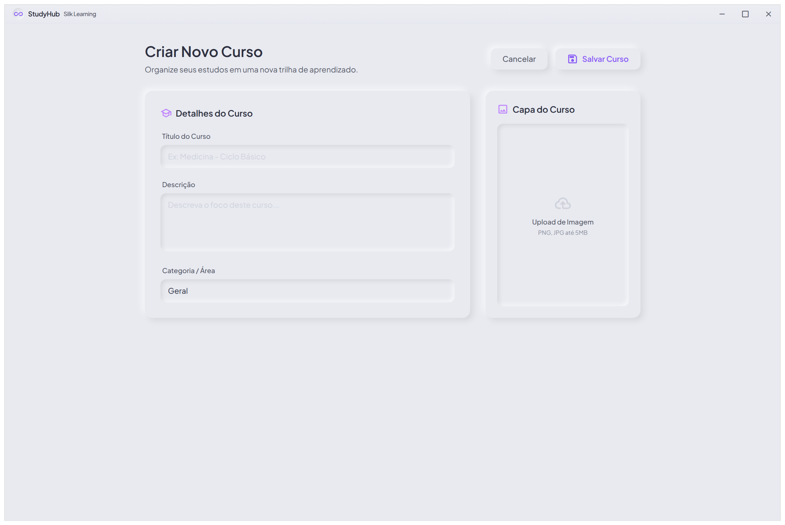
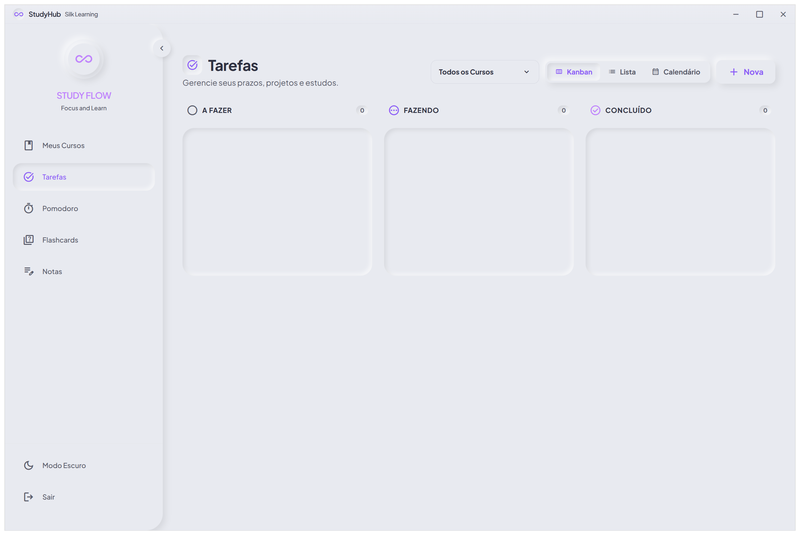
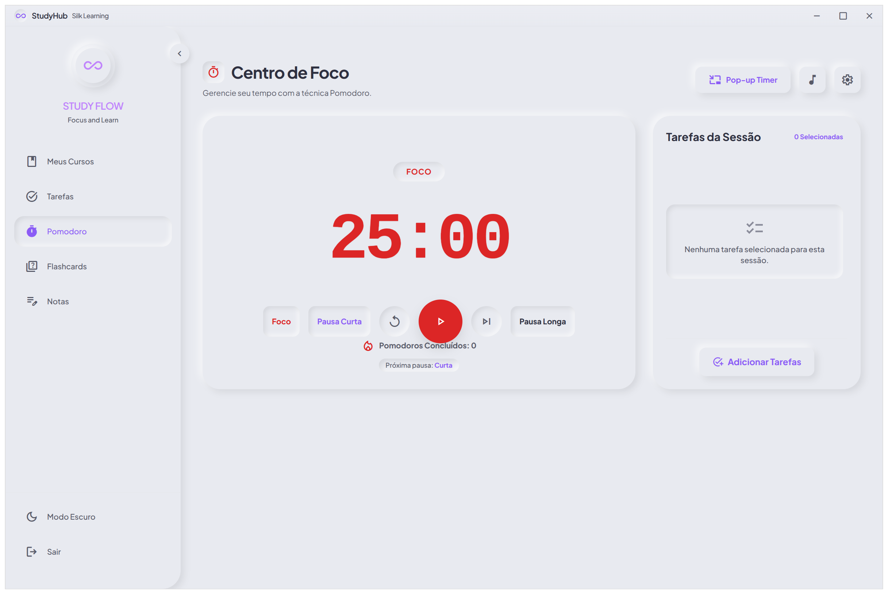
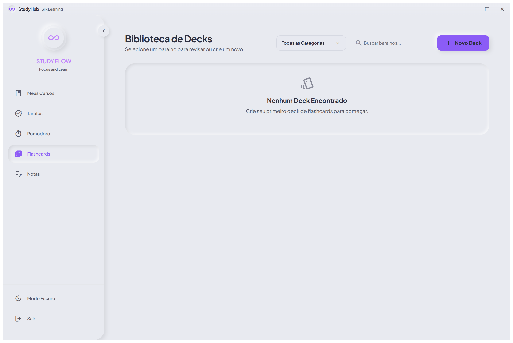
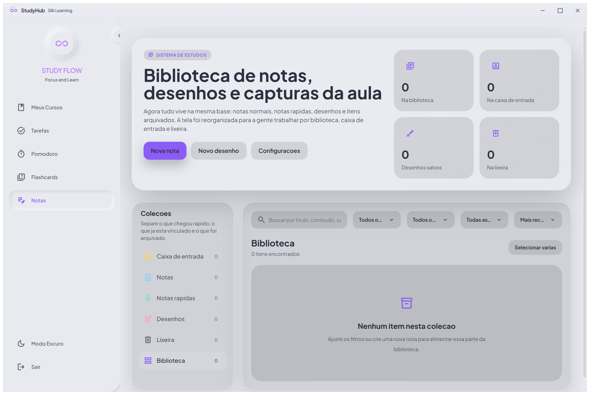

# Auditoria de produto do StudyHub

Data: 20/07/2026

## Escopo e objetivo

A auditoria considera o StudyHub como um aplicativo desktop individual para organizar materiais, planejar estudos, manter foco, registrar conhecimento e revisar o que foi aprendido. O fluxo ideal avaliado foi:

`planejar → focar → estudar → anotar → revisar → acompanhar progresso`

Foram usados o aplicativo em execução no KDE/Linux, capturas reais das telas vazias/primeiro uso, leitura do código React/Electron, build de produção e suíte de testes. O alvo de acessibilidade considerado foi operação completa por teclado e contraste WCAG AA para texto normal.

## Veredito

O produto já tem uma identidade visual reconhecível e uma quantidade incomum de recursos úteis. O problema principal é que eles ainda funcionam como ferramentas paralelas. Cursos, tarefas, Pomodoro, notas, flashcards, projetos, tradutor e laboratórios não formam um ciclo único e confiável.

A ordem recomendada é:

1. estabilizar dados, segurança, atalhos/captura e fluxos quebrados;
2. transformar a tela inicial em uma tela **Hoje**, guiada pelo contexto real do usuário;
3. conectar todas as entidades e adicionar busca global;
4. só depois expandir colaboração, nuvem e novas ferramentas.

## Auditoria visual do fluxo

### 1. Entrada / painel — saúde: atenção (2/5)

Pontos positivos:

- linguagem visual coesa, boa legibilidade dos títulos e navegação lateral clara;
- o estado vazio de cursos tem uma ação explícita;
- existe espaço para continuar uma aula quando já há contexto salvo.

Problemas:

- o desafio C# ocupa o maior espaço antes mesmo de existir um curso e pode ser irrelevante para quem não estuda programação;
- há dois botões “Criar Curso” no mesmo estado vazio;
- o indicador `0%` não explica o que mede nem ensina como avançar;
- a mesma janela usa três identidades: **StudyHub**, **Silk Learning** e **Study Flow / Focus and Learn**;
- o item “Meus Cursos” funciona como painel geral, criando diferença entre o nome da navegação e o conteúdo exibido.

Melhoria: substituir esse primeiro estado por um onboarding curto e, depois, por uma tela **Hoje** com aula em andamento, tarefas prioritárias, revisões vencidas e meta de foco. O desafio diário deve ser personalizado ou ficar dentro do Code Lab.

### 2. Escolha de criação — saúde: base boa (3/5)

Pontos positivos:

- as duas rotas são fáceis de comparar;
- títulos, explicações e ações têm boa hierarquia.

Problemas:

- “Sincronizar Pasta” sugere acompanhamento contínuo, mas o código faz uma importação pontual;
- “a inteligência do app” não informa que a organização depende principalmente de nomes e pastas;
- não há prévia, detecção de conflitos, escolha de ordem ou possibilidade de desfazer antes de gravar;
- o modal não possui `role="dialog"`, `aria-modal`, contenção/restauração de foco ou fechamento padronizado por teclado.

Melhoria: renomear para **Importar pasta**, mostrar a estrutura detectada antes de confirmar e listar arquivos ignorados, duplicados ou classificados incorretamente.

### 3. Criação manual — saúde: incompleto (2/5)

Pontos positivos:

- formulário curto, com boa separação entre dados e capa;
- Cancelar e Salvar estão visíveis sem rolagem.

Problemas confirmados no código:

- a área “Upload de Imagem” é apenas visual, sem seletor ou ação;
- salvar sem título falha silenciosamente, sem mensagem no campo;
- o curso grava `description`, mas outra tela lê `subtitle`;
- labels não estão ligadas aos inputs e os estilos removem o foco visível;
- categoria em texto livre cria grafias duplicadas e filtros inconsistentes.

Melhoria: concluir o upload ou removê-lo temporariamente, mostrar validação inline, unificar o contrato dos campos e oferecer categorias sugeridas com criação opcional.

### 4. Tarefas — saúde: atenção (2/5)

Pontos positivos:

- Kanban, lista e calendário atendem estilos diferentes de planejamento;
- filtro por curso e ação “Nova” ficam fáceis de encontrar.

Problemas:

- o primeiro uso mostra três grandes superfícies vazias sem instrução ou ação dentro das colunas;
- filtros ocupam espaço antes de existir conteúdo;
- cards, calendário e arrastar/soltar não têm alternativa completa por teclado;
- tarefas criadas em Aula/Imersão usam campos diferentes dos filtros gerais e podem desaparecer do curso correto;
- tarefas de Workspace formam outra coleção isolada.

Melhoria: usar uma entidade única com `context: { courseId, moduleId, lessonId, workId }`, um estado vazio com modelo de primeira tarefa e ações explícitas para mover o item sem depender de arrastar.

### 5. Centro de foco — saúde: boa (4/5)

Pontos positivos:

- esta é a tela mais focada do produto: tempo, ação principal e tarefas da sessão são imediatamente entendidos;
- a hierarquia visual está adequada e o estado vazio oferece “Adicionar Tarefas”.

Problemas:

- uma sessão concluída não vira histórico confiável de tempo ligado à tarefa/aula;
- controles de som e configurações dependem de ícones sem uma base consistente de nomes acessíveis;
- notificações, sons e dependências não possuem uma ação única de teste/diagnóstico.

Melhoria: criar `FocusSession`, registrar duração real e contexto, mostrar resumo no fim e atualizar esforço/progresso da tarefa sem alterar o progresso acadêmico artificialmente.

### 6. Flashcards — saúde: regular (3/5)

Pontos positivos:

- estado vazio simples e ação clara;
- busca e categoria preparam a tela para crescimento.

Problemas:

- falta uma fila principal de **revisões de hoje**;
- a tela é centrada em decks, não na decisão “o que devo revisar agora?”;
- criar um deck novo pode falhar porque `activeLessonId` é usado sem declaração;
- a revisão adiantada altera o agendamento, embora devesse poder funcionar como prática neutra.

Melhoria: adicionar repetição espaçada com respostas **Errei / Difícil / Bom / Fácil**, intervalos visíveis, histórico, modo prática e importação/exportação CSV/Anki.

### 7. Biblioteca de notas — saúde: atenção (2/5)

Pontos positivos:

- visão ambiciosa de biblioteca única para notas, capturas e desenhos;
- caixa de entrada e coleções são uma boa base para organizar captura rápida.

Problemas:

- com zero itens já aparecem quatro métricas, três ações, seis coleções, busca e quatro filtros;
- vários filtros ficam truncados mesmo em uma janela grande;
- o estado vazio compete com controles que ainda não têm utilidade;
- notas, notas legadas, desenhos e transcrições usam armazenamentos/modelos diferentes.

Melhoria: revelar filtros e métricas conforme houver conteúdo; manter uma ação principal, uma caixa de entrada unificada e autosave com estado visível, histórico e exportação Markdown/PDF.

## Correções P0 antes de adicionar módulos grandes

| Área | Evidência | Correção recomendada |
|---|---|---|
| Dados | Estado principal em `localStorage`, desenhos base64 no mesmo JSON, transcrições em IndexedDB e mídia por caminho absoluto | SQLite no processo principal, blobs em arquivos, migração, backup rotativo e exportar/restaurar `.studyhub` |
| Contratos | `description/subtitle`, tarefas com IDs incompatíveis, progresso global somado em blocos fixos de 5% | Tipar/normalizar entidades e derivar progresso dos dados reais |
| Fluxos quebrados | upload de capa sem ação; Code Lab pede consentimento que não é renderizado; Hub troca mídia sem abrir player; “Sair” lateral não executa | Testes E2E dos fluxos canônicos e correção antes da expansão |
| Linux | Electron/portal e atalhos do KDE disputam registro; UI engole o erro; launchers atuais misturam builds | Um único backend por capacidade, um launcher canônico e tela de diagnóstico |
| Captura | tela inteira é transferida como data URL e recortada no renderer; backend depende do ambiente | adaptadores X11/portal/Spectacle testáveis e recorte nativo por arquivo/buffer |
| Segurança | janelas usam `sandbox: false`, `webSecurity: false`; launcher atual usa `--no-sandbox`; IPCs têm validação desigual | habilitar proteções, validar origem/payload, bloquear navegação/popups e restringir execução/acesso a arquivos |
| Acessibilidade | 19 overlays sem semântica de diálogo; cards pointer-only; sem `focus-visible` ou movimento reduzido | componentes base `Dialog`, `Button`, `Field`, `Tabs` e operação integral por teclado |
| Visual | seis tokens CSS usados mas não definidos; contrastes de 2,77:1 a 4,23:1 em combinações recorrentes | completar tokens claro/escuro e validar contraste automaticamente |
| Compatibilidade | janela mínima `1280×860` não cabe em notebooks `1366×768` com painel/escala | suportar pelo menos `960×640`, sidebar recolhível/drawer e testes com zoom 200% |

## O que adicionar com maior retorno

### P1 — consolidar o produto

1. **Tela Hoje e onboarding**: criar/importar primeiro curso, definir objetivo e mostrar apenas a próxima ação relevante.
2. **Busca global e command palette**: cursos, aulas, notas, tarefas, flashcards, projetos e ações como nota rápida/tradutor.
3. **Fila de revisão espaçada**: ligar cards criados na aula, nota e tradutor a uma agenda única.
4. **Planejador de estudo**: transformar prazos em sessões e relacionar Pomodoro, tarefa e conteúdo estudado.
5. **Biblioteca confiável**: autosave, histórico, anexos gerenciados, links entre entidades e exportação/restauração.
6. **Central de diagnóstico**: versão/build real, caminho do executável, Wayland/X11, backend de captura, status de cada atalho, portal, OCR, quota, FFmpeg, Python/Whisper, .NET e Ollama.

### P2 — depois da estabilização

1. índice global de Projetos/Workspaces ligado às tarefas gerais;
2. tradução oficial configurável e alternativa local/offline, com privacidade explícita;
3. sincronização entre dispositivos e colaboração real — só então usar linguagem de convites/chat compartilhado;
4. AppImage, deb, rpm e Windows instalável para x64/ARM64, com assinatura, checksum, atualização, rollback e CI.

## Arquitetura e qualidade

- `ImmersionScreen.jsx` tem cerca de 2.865 linhas, `LessonScreen.jsx` 2.503, `LanguageLabModal.jsx` 1.407 e o store principal passa de mil linhas. Dividir por domínio reduzirá regressões e facilitará testes.
- O build passou, mas o chunk principal ficou em aproximadamente 1,22 MB minificado, além de worker PDF e fonte de ícones muito grandes. As telas pesadas devem ser carregadas sob demanda.
- Os 53 testes atuais passaram, porém cobrem principalmente utilitários e serviços. Não há cobertura JSX/acessibilidade e o Playwright instalado não cobre o app empacotado.
- Priorizar testes de criação/persistência/importação, atalhos/captura, teclado, claro/escuro, `1024×768`, `1280×720`, zoom de 200% e release empacotada.
- A distribuição atual tem aproximadamente 261 MB, versão fixa `1.0.0`, metadados provisórios e somente Linux x86_64 no fluxo principal.

## Limites da evidência

As capturas representam o estado vazio/primeiro uso em uma janela grande no KDE/Linux. Não foram executados neste passe um leitor de tela, uma matriz física GNOME/KDE/X11/Wayland/multimonitor, nem todo o fluxo com uma biblioteca preenchida. Achados de comportamento não visíveis nas capturas foram confirmados diretamente no código; desempenho percebido e compatibilidade ampla ainda exigem testes empacotados em máquinas/VMs distintas.
