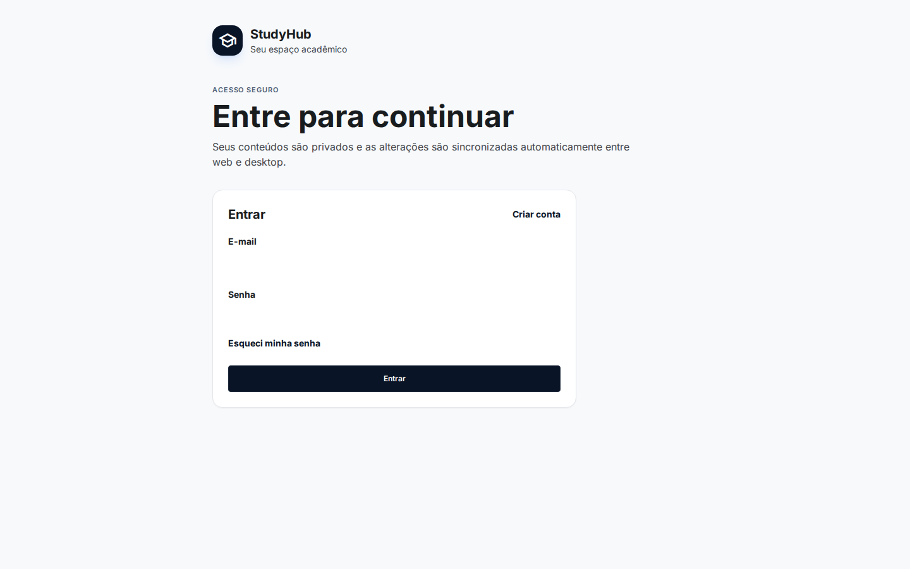
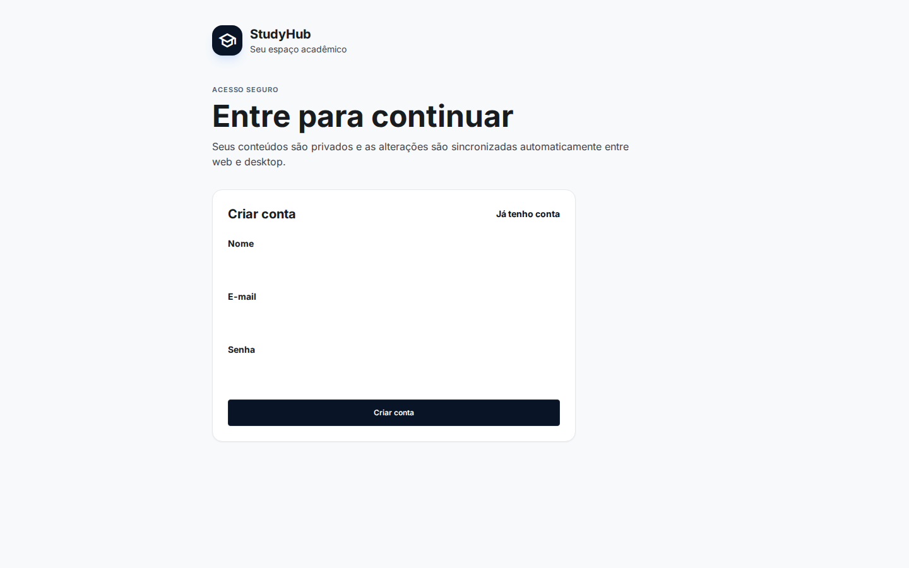
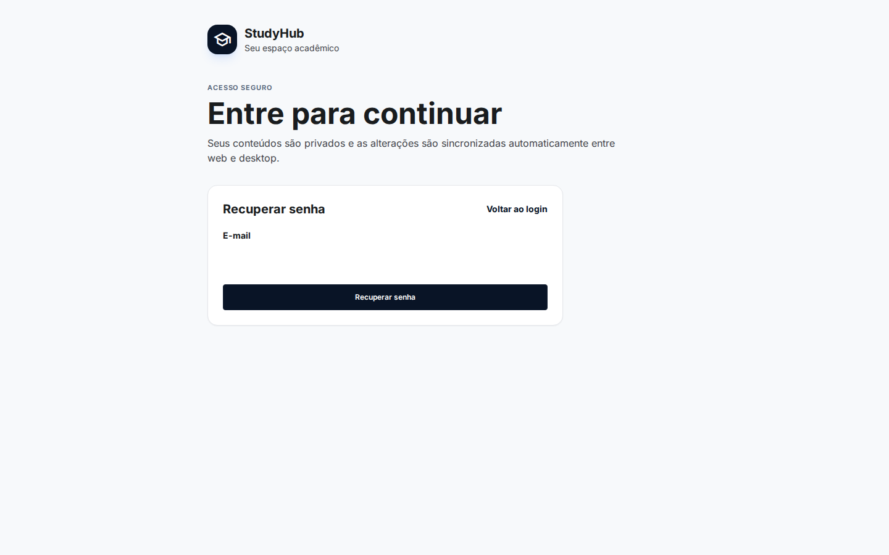
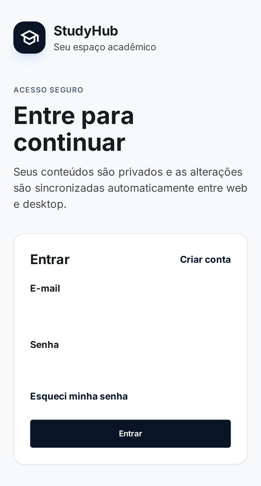

# Auditoria de oportunidades do site StudyHub

Data: 31 de julho de 2026  
Site observado: `https://studyhub-desktop.vercel.app`

Board FigJam: `https://www.figma.com/board/8HfKxtBGmtdhauv61bK5gG`

## Conclusão executiva

O StudyHub já possui um núcleo acadêmico amplo. A próxima etapa de maior retorno não é adicionar mais uma agenda, outro gerenciador de tarefas ou outro editor: é transformar o produto existente em uma experiência web confiável, compreensível e fácil de começar.

As prioridades são:

1. corrigir a entrada e o cadastro;
2. criar uma apresentação pública do produto;
3. conduzir o usuário até o primeiro resultado com onboarding;
4. tornar a IA web previsível e explicável;
5. preparar sincronização, observabilidade, limites e monetização para escala.

## Evidência e limites

- As telas públicas foram capturadas diretamente da versão publicada usando Playwright, em perfil limpo.
- Não foi criada uma conta nem usado o perfil autenticado do usuário. Por isso, as telas internas não receberam uma auditoria visual de produção.
- O inventário das funcionalidades internas e das lacunas técnicas foi verificado no código atual, nas migrações Supabase e na configuração Vercel.
- Os pontos de acessibilidade abaixo são riscos visíveis; não equivalem a uma auditoria completa de conformidade.

## Fluxo público observado

### 1. Entrada no desktop — saúde crítica

A hierarquia de título e botão é clara, mas os campos de e-mail e senha não têm contorno, preenchimento contrastante ou outro limite visível. No site publicado, ambos medem 526 × 40 px, porém usam `border: 0` e fundo branco sobre um cartão branco. O usuário vê grandes áreas vazias e pode não entender onde clicar.

### 2. Criação de conta — saúde crítica

O mesmo problema se repete em três campos. Também faltam requisitos de senha antes do envio, aceite/links para termos e privacidade e uma explicação curta do que acontece após a confirmação de e-mail.

### 3. Recuperação de senha — precisa de ajuste

O fluxo é simples, mas o único campo também está invisível. É importante mostrar o endereço de entrada, estado de foco, confirmação de envio e ação de reenvio com tempo de espera.

### 4. Entrada no celular — saúde crítica

O conteúdo se reorganiza sem corte horizontal, o que é positivo. Porém, os campos invisíveis geram espaços vazios muito maiores no celular e fazem a ação principal parecer desconectada dos dados que a alimentam.

## Problemas a resolver antes de acrescentar módulos

### P0 — entrada, confiança e estabilidade

1. **Corrigir todos os campos de autenticação.** Aplicar borda, fundo, padding, foco, erro e estado preenchido. A causa atual está no reset global de `input` combinado com a ausência de estilo específico no formulário de conta.
2. **Separar site público e aplicativo.** Usar `/` para uma landing page e `/app` para o produto autenticado. A landing deve mostrar proposta de valor, imagens reais, principais fluxos, privacidade, compatibilidade web/desktop, perguntas frequentes e CTA para criar conta.
3. **Unificar a marca.** A entrada usa “StudyHub”, enquanto a navegação interna usa “CampusFlow”. Escolher um nome principal e deixar o outro apenas como edição/produto, se necessário.
4. **Completar a confiança do cadastro.** Adicionar termos, política de privacidade/LGPD, exportação de dados, suporte, requisitos de senha e autenticação com Google ou Microsoft. Configurar SMTP próprio, CAPTCHA e proteção de tentativas antes de abrir amplamente.
5. **Recuperar automaticamente falhas de atualização.** Quando um chunk antigo deixa de existir após um deploy, exibir “Há uma nova versão” e recarregar uma única vez, em vez de cair em “Something went wrong”.
6. **Adicionar observabilidade.** Registrar falhas de carregamento, sincronização, upload, WebLLM e telas de erro, com ID copiável e sem enviar conteúdo acadêmico privado.

## O que já existe e não deve ser duplicado

O código atual já cobre:

- dashboard “Hoje”, calendário, tarefas e detalhes com subtarefas;
- semestres, disciplinas, notas, frequência, simulador de notas e planejamento;
- cursos, hubs, módulos e aulas;
- notas, materiais, arquivos, desenhos, livros, PDF/EPUB e editor rico;
- flashcards, revisões e Pomodoro;
- trabalhos, projetos em grupo e projetos de programação;
- busca global e atalhos;
- autenticação, sincronização automática, histórico de até 30 versões e arquivos privados no Supabase;
- compartilhamento de notas, desenhos, arquivos, disciplinas, projetos, tarefas, cursos e aulas com permissões;
- comentários e edição em tempo real de notas compartilhadas;
- IA com Ollama no desktop e WebLLM no navegador.

## Funcionalidades que realmente agregariam valor

| Prioridade | Adição | Por que vale a pena | Tamanho |
|---|---|---|---|
| P0 | Onboarding acadêmico guiado | Leva o novo usuário de conta vazia até semestre, matérias, horários e primeira tarefa sem depender de exploração | M |
| P0 | Central de compatibilidade web | Testa WebGPU, armazenamento, notificações, tamanho disponível e recursos exclusivos do desktop; evita promessas que o navegador não cumpre | S |
| P0 | Gerenciador de IA web | Mostra modelo, tamanho do download, progresso, espaço usado, qualidade esperada, cancelar/remover modelo e teste rápido | M |
| P1 | PWA instalável e captura rápida | Permite abrir como app, criar tarefa/nota pelo celular e consultar conteúdo recente com conexão instável | L |
| P1 | Central de notificações | Reúne prazos, aulas, revisões, convites, comentários e falhas de sincronização; com preferências por tipo e canal | M |
| P1 | Importação acadêmica | Começar por `.ics` e CSV; depois importar exportações do Moodle/Canvas. Reduz muito a configuração inicial | M–L |
| P1 | Revisão semanal inteligente | Resume progresso, atrasos, frequência, notas, foco e recomenda três prioridades para a semana | M |
| P1 | Colaboração 2.0 | Menções, caixa de atividade, histórico por item, presença e comentários também em tarefas/projetos, aproveitando o backend já existente | L |
| P1 | Upload profissional | Fila, progresso, retomar, miniaturas, verificação de tipo, quota visível e tratamento de arquivo infectado ou inválido | L |
| P2 | Modelos acadêmicos | Galeria para trabalho ABNT, relatório técnico, artigo IEEE, projeto de pesquisa e lista de exercícios | M |
| P2 | Integração com calendários | Assinatura/publicação `.ics` primeiro; Google/Outlook com OAuth depois | L |
| P2 | Espaços de turma e grupos | Um espaço compartilhado com membros, matérias, projeto, arquivos, tarefas e papéis, sem precisar convidar item por item | L |
| P2 | Plano pago e administração | Assinaturas, limites, uso de armazenamento, painel de suporte, bloqueio de abuso e trilha de auditoria | L |

## Melhorias específicas para a IA web

A implementação atual oferece Qwen 0.5B como opção leve e Llama 1B como opção de maior qualidade. Isso é adequado para dispositivos modestos, mas modelos tão pequenos têm limitações reais para respostas acadêmicas complexas.

Adicionar:

- diagnóstico antes do download: navegador, WebGPU, memória estimada e armazenamento;
- seleção restrita apenas aos modelos realmente executáveis na web;
- explicação “mais rápido” versus “melhor resposta”;
- barra de download com tamanho, cancelamento e retomada;
- tela para apagar o cache do modelo;
- redução e seleção automática de contexto para evitar estouro de 4.096 tokens;
- respostas com fontes escolhidas pelo usuário e aviso quando não houver evidência;
- teste curto pós-instalação para confirmar que o modelo funciona;
- opção futura de provedor remoto, explicitamente opt-in, para quem preferir qualidade a processamento local.

## Ajuste arquitetural importante para crescer

Hoje o conteúdo pessoal é sincronizado principalmente como um único documento JSON em `account_state`, com limite seguro de 7,5 MB e merge no cliente. Backups e revisão otimista diminuem o risco, mas esse modelo fica mais caro e sujeito a conflitos à medida que a conta cresce.

Antes de escalar o SaaS, migrar gradualmente para registros por entidade:

- uma linha por nota, tarefa, disciplina, deck, projeto e metadado de arquivo;
- `updated_at`, versão e tombstone por item;
- sincronização incremental e fila offline;
- histórico por entidade;
- operações idempotentes;
- arquivo binário sempre no Storage, nunca dentro do estado JSON.

O `account_state` pode permanecer durante a transição como snapshot de compatibilidade e recuperação.

## Ordem recomendada de execução

### Sprint 1 — tornar utilizável e confiável

- campos de login/cadastro e estados de erro/foco;
- nome único da marca;
- landing pública mínima;
- SMTP, CAPTCHA, termos e privacidade;
- recuperação de chunk/deploy e monitoramento de erros;
- diagnóstico e gerenciador de WebLLM.

### Sprint 2 — ativar e reter

- onboarding de semestre e matérias;
- importação `.ics`/CSV;
- central de notificações;
- PWA e captura rápida;
- revisão semanal.

### Sprint 3 — colaborar e vender

- espaços de grupo, atividade, menções e histórico;
- normalização gradual do backend;
- quotas, painel administrativo e suporte;
- planos e cobrança;
- integrações Google/Outlook/LMS conforme demanda real.

## Recomendação final

Se apenas um pacote for feito agora, deve ser **entrada pública + onboarding + confiabilidade web**. O produto já tem bastante profundidade depois do login; o gargalo atual é que um visitante não consegue perceber esse valor e pode ter dificuldade até para localizar os campos de acesso.
